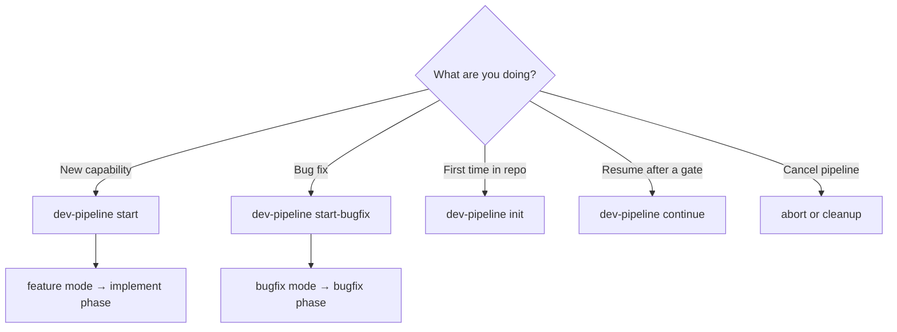
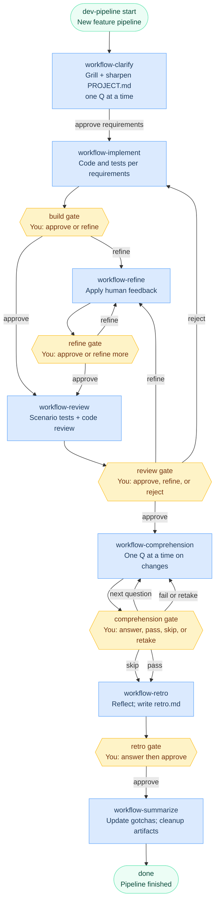
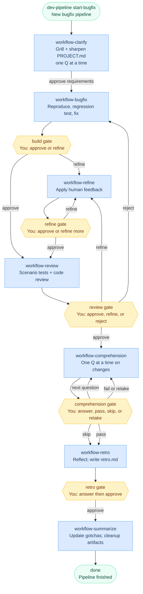

# Dev Pipeline

[](https://skills.sh/D-Andreev/ai-workflow)

Multi-phase development workflow with human review gates. Orchestrated by the `dev-pipeline` skill.

Installable with the [skills](https://www.npmjs.com/package/skills) CLI — the open agent skills ecosystem for Cursor, Claude Code, Codex, and 68+ other agents.

## Quickstart

### 1. Install skills

Install from GitHub with `npx` — no clone required. From your project (project-scoped) or home directory (global):

```bash
# Project-scoped — skills live in .agents/skills/
INSTALL_INTERNAL_SKILLS=1 npx skills add D-Andreev/ai-workflow --copy --skill '*' -a cursor -y

# Global — skills live in ~/.cursor/skills/
INSTALL_INTERNAL_SKILLS=1 npx skills add D-Andreev/ai-workflow --copy --skill '*' -a cursor -g -y
```

`INSTALL_INTERNAL_SKILLS=1` includes internal phase skills (`workflow-*`) the orchestrator launches automatically.

List available skills without installing:

```bash
npx skills add D-Andreev/ai-workflow --list
```

Update installed skills later:

```bash
npx skills update -y
```

### 2. Set up your project

In the target repo, run init once:

```
/dev-pipeline init
```

This creates `.cursor/workflows/` directories, seeds `learnings/gotchas.md`, and generates `PROJECT.md`. **Do not hand-write `PROJECT.md`** — init inspects the repo and writes project facts; clarify adds domain terms to `## Language` during the first pipeline.

To regenerate `PROJECT.md` after stack changes: `/dev-pipeline init refresh`

Ephemeral files (`artifacts/`, `state.json`, `STATUS.md`) are created automatically when you start a pipeline. Add them to `.gitignore` — see [Gitignore](#gitignore).

### 3. Start a pipeline

New feature:

```
/dev-pipeline start "Add retry logic to notification emails"
```

Bug fix:

```
/dev-pipeline start-bugfix "Fix duplicate notification emails on retry"
```

## Skills

**User-invoked** skills are reachable when you type them (e.g. `/dev-pipeline`). **Internal** phase skills are launched by the orchestrator — install them with `INSTALL_INTERNAL_SKILLS=1` or `--skill '*'`.

| Skill | Invoke | Purpose |
|-------|--------|---------|
| `dev-pipeline` | `/dev-pipeline` | Init, start, status, continue, cleanup, and orchestrate the pipeline |
| `workflow-*` | (internal) | Phase work — launched by the orchestrator |

## Which command to use?



| Situation | Command |
|-----------|---------|
| New feature | `/dev-pipeline start "<task>"` |
| Bug fix | `/dev-pipeline start-bugfix "<task>"` |
| First-time repo setup | `/dev-pipeline init` |
| Regenerate PROJECT.md | `/dev-pipeline init refresh` |
| Explicit diff base | `/dev-pipeline start "<task>" --base develop` |
| Resume pipeline | `/dev-pipeline continue` (new agent; approve assumed on advance gates) |
| Cancel + delete ephemeral files | `abort` or `/dev-pipeline cleanup` |

Both **feature** and **bugfix** share the same phases after clarify; only the build step differs.

## Monitor progress

| What | Where |
|------|-------|
| Human-readable status | `.cursor/workflows/STATUS.md` (active pipeline only) |
| Machine state | `.cursor/workflows/state.json` (JSON Schema in skill bundle) |
| Routing rules | Installed skill bundle: `dev-pipeline/state-schema.md` (single source of truth) |
| In chat | `/dev-pipeline status` or `/dev-pipeline continue` |

Open `STATUS.md` in your editor and refresh after each agent turn.

### Multi-agent flow with `/dev-pipeline continue` (recommended)

1. **Start** — `/dev-pipeline start "<task>"` or `start-bugfix` in one agent
2. **Continue** — open a **new agent** and run `/dev-pipeline continue`

At each gate, send the command for that step — usually `approve` to advance, or `refine:` (and at review, `reject:`) to iterate. **Recommended:** open a new agent after each phase; fresh context per step usually works better than running the whole pipeline in one chat. On advance gates, bare `/dev-pipeline continue` assumes approve and runs the next phase. Gates that need your input (**clarify**, **comprehension interview**, **retro questions**) wait for answers — no auto-advance. To stay in the same agent, send the gate command directly.

## Phases

Shared phase reference:

| Phase | Who | What happens |
|-------|-----|--------------|
| **clarify** | AI + you | **Grill-with-docs session:** one question at a time (with a recommended answer). Challenges fuzzy terms against `PROJECT.md`, stress-tests with scenarios, cross-checks code. Updates `## Language` in `PROJECT.md` and `requirements.md` as terms resolve (max **3 passes**). May add ADRs to `docs/adr/` for hard-to-reverse decisions. No application code. |
| **implement** | AI | (feature only) Code + tests per requirements. Reads `PROJECT.md` and `gotchas.md`. |
| **bugfix** | AI | (bugfix only) Reproduce → regression test → minimal fix. Reads `PROJECT.md` and `gotchas.md`. |
| **refine** | AI | Addresses review feedback. |
| **review** | AI | Fresh-eyes scenario tests plus principles/security/design review in one pass → `review-report.md`. |
| **comprehension** | AI + you | **One question at a time** (free text or multiple choice) until you demonstrate understanding of functionality, code, and maintenance. Question count adapts to the diff. Pass or `skip-comprehension`. |
| **retro** | AI + you | **Two turns:** reflective questions → your answers → `retro.md` → `approve`. |
| **summarize** | AI | Consolidate `gotchas.md`, optional `PROJECT.md` feature update (not glossary), delete ephemeral files. |

### Feature pipeline (`/dev-pipeline start`)



### Bugfix pipeline (`/dev-pipeline start-bugfix`)



## Commands (at human gates)

| You type | Effect |
|----------|--------|
| `approve requirements` | clarify → build phase (implement or bugfix, depending on mode) |
| `approve` | Advance to next phase |
| `refine: <feedback>` | Go to refine |
| `re-clarify: <note>` | Back to clarify |
| `reject: <reason>` | Back to build from **review** (implement in feature mode, bugfix in bugfix mode) |
| `ready` / `retake` | After failed comprehension interview — new attempt |
| `skip-comprehension` | Skip interview unpassed (recorded; alias: `take the shame`) |
| `abort` | Cancel and **delete ephemeral files** |
| `/dev-pipeline cleanup` | Delete orphaned artifacts/state/STATUS |
| `/dev-pipeline continue` | New agent: resume — approve assumed on advance gates |

Full routing: installed `dev-pipeline/state-schema.md` skill file

### Clarify gate

1. Agent asks **one question** with a **recommended answer** — reply with your answer (or accept the recommendation).
2. Agent updates `requirements.md` and sharpens `PROJECT.md` (`## Language`) when domain terms crystallise — one file, no separate `CONTEXT.md`.
3. When the agent presents a summary, reply **`approve requirements`** to advance — or answer more if it asks follow-ups.
4. Max **3 passes**; after that, open items become explicit **Assumptions** in `requirements.md`. Use `re-clarify:` to reset.

### Comprehension gate

1. Agent asks **one question** at a time (free text or multiple choice) about what changed, where it lives in code, and how to maintain it.
2. Reply with your answer; the agent grades it and asks the next question until satisfied or failed.
3. If you **pass** → `approve` → retro.
4. If you **fail** → review code → `ready` for retake **or** `skip-comprehension` to proceed (waives quality gate; recorded).

### Retro gate (two turns)

1. **Turn 1:** Agent asks 3–5 reflective questions → **stop**. Reply with your answers (same or new chat with `/dev-pipeline continue` + answers).
2. **Turn 2:** Agent writes `retro.md` → reply **`approve`** → summarize runs automatically.

## State and diffs

On start, the pipeline records `base_branch` in `state.json` (default: `origin/main`, else `main`, else current branch). All phases use:

```bash
git diff {base_branch}...HEAD
```

Override at start: `/dev-pipeline start "<task>" --base develop` (also works with `start-bugfix`)

## Artifacts (ephemeral)

During a run, handoffs live in `.cursor/workflows/artifacts/`. **Deleted on summarize, abort, or cleanup:**

- `task.md`, `requirements.md`, `implement-handoff.md`, `review-report.md`, `comprehension-test.md`, `retro.md`

## Durable docs (persist)

All paths are under `.cursor/workflows/` unless noted.

| File | Purpose |
|------|---------|
| `PROJECT.md` | **Single shared context** — stack, features, dev commands (from init/setup) **and** domain glossary (`## Language`, from clarify). No separate `CONTEXT.md`. |
| `docs/adr/` | Architectural decisions recorded during clarify (when warranted) |
| `learnings/gotchas.md` | Consolidated pitfalls (≤20 bullets; rewritten each run) |

### PROJECT.md lifecycle

| When | What changes |
|------|--------------|
| **Setup / init** | Project name, overview, features, stack, dev commands. `## Language` starts empty. |
| **Clarify** | `## Language` grows term-by-term; optional ADRs in `docs/adr/`. |
| **Summarize** | Overview or Main Features updated only for **major** new capabilities — not glossary edits. |

## Gitignore

Ephemeral pipeline files are recreated each run and deleted on summarize, abort, or cleanup. **Do not commit them** — add these lines to your project's `.gitignore`:

```gitignore
# Dev pipeline — ephemeral (deleted on summarize, abort, or cleanup)
.cursor/workflows/state.json
.cursor/workflows/STATUS.md
.cursor/workflows/artifacts/*
!.cursor/workflows/artifacts/.gitkeep
```

Init creates `.cursor/workflows/artifacts/.gitkeep` so the directory exists in git while ignoring handoff files inside it.

**Commit** durable workflow docs (shared team context):

| Path | Purpose |
|------|---------|
| `.cursor/workflows/PROJECT.md` | Project facts + domain glossary |
| `.cursor/workflows/learnings/gotchas.md` | Consolidated pitfalls |
| `docs/adr/` | Architectural decisions (when clarify records them) |

## End-to-end walkthrough (feature example)

**Task:** `/dev-pipeline start "Add retry logic to notification emails"`

1. **clarify** — Agent grills one question at a time; sharpens domain terms in `PROJECT.md` (`## Language`); you reply; repeat until summary → `approve requirements`
2. **implement** — Code + tests → `implement-handoff.md` → you `approve` or `/dev-pipeline continue`
3. **review** — Fresh-eyes scenarios + principles review → `review-report.md` → `approve`
4. **comprehension** — One question at a time until understanding is demonstrated → `approve`
5. **retro** — Agent asks reflective questions → you answer → `retro.md` → `approve`
6. **summarize** — Updates gotchas, deletes artifacts

**Snippet — PROJECT.md `## Language` (after clarify):**

```markdown
## Language

**Notification**:
An outbound message (email, SMS, etc.) queued for delivery to a recipient.
_Avoid_: Message, alert

**Retry**:
A re-attempt to deliver a notification after a transient failure, bounded by a max count and backoff policy.
_Avoid_: Resend
```

**Snippet — requirements.md (after clarify):**

```markdown
## Clarifications

| # | Question | Answer | Recommended |
|---|----------|--------|-------------|
| 1 | Max retries before giving up? | 3 with exponential backoff | 3 — matches existing job runner cap |

## Acceptance criteria
- [ ] Failed sends retry with exponential backoff (max 3)
- [ ] Idempotent — no duplicate emails on retry

## Implementation approach (high level)
- Extend `NotificationJob` **Retry** policy; reuse `backoff()` from job runner (see PROJECT.md ## Language)
```

**Snippet — review-report.md:**

```markdown
## Verdict
APPROVE WITH NOTES

## Scenario verification
### Scenarios tested
| # | Scenario | Method | Result | Notes |
| 1 | Retry on transient failure | test | pass | ... |

## Principles review
### Summary
Backoff config matches existing job runner patterns; auth boundary on retry endpoint looks correct.
```

## End-to-end walkthrough (bugfix example)

**Task:** `/dev-pipeline start-bugfix "Fix duplicate notification emails on retry"`

1. **clarify** — Same grill-with-docs flow; defines terms like **Retry** and **Idempotency** in `PROJECT.md` if not already present
2. **bugfix** — Reproduce → failing regression test → minimal fix → `implement-handoff.md` → `approve`
3. **review** → **comprehension** → **retro** → **summarize** (same as feature pipeline from here)

On **reject** at review, the pipeline returns to **bugfix** (not implement).

## Troubleshooting

| Problem | Fix |
|---------|-----|
| Skills not found after install | Use `INSTALL_INTERNAL_SKILLS=1` and `--skill '*'`; run `npx skills list` to verify |
| Stuck `status: ai_running` | `/dev-pipeline continue` — recovers if artifact complete; else re-run phase skill |
| Accidental implicit approve | Use `/dev-pipeline continue refine:` instead; clarify/comprehension/retro never auto-approve |
| Partial summarize (files left behind) | `/dev-pipeline cleanup` |
| Active pipeline won't start | `abort` or cleanup first |
| Wrong diff base | Restart with `--base <branch>` |
| Comprehension feels too long | Agent adapts question count to diff size; answer clearly to move on |
| PROJECT.md missing `## Language` | Normal after init — clarify adds terms during the first pipeline |

## Repo layout

Source layout for contributors. **Users install skills with `npx`** — you do not need to clone this repo to use the pipeline.

| Path | Purpose |
|------|---------|
| `skills/dev-pipeline/` | Orchestrator skill + state schema + fixtures |
| `skills/phases/` | Internal phase skills (`workflow-*`, including init) |

Install with [skills CLI](https://www.npmjs.com/package/skills):

```bash
INSTALL_INTERNAL_SKILLS=1 npx skills add D-Andreev/ai-workflow --copy --skill '*' -a cursor -y
```
