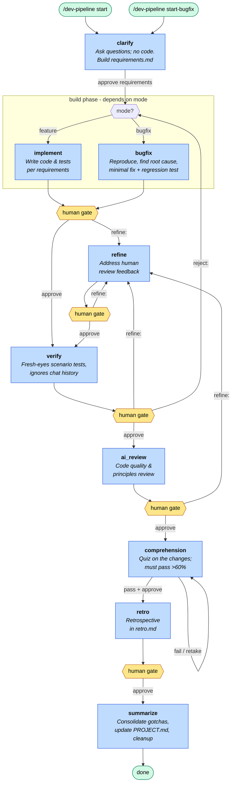

# Dev Pipeline (Cursor CLI)

Multi-phase development workflow with human review gates. Orchestrated by the `dev-pipeline` skill.

### I'm using Cursor CLI, so all of these live inside the `.cursor. folder in my projects. If you're using something else like claude you can use the content of these and make them work for your AI tool.

## First-time setup (per repo)

These skills are designed to be reused across projects. When dropping them into a new repo, generate a project-specific `PROJECT.md` first:

```
/dev-pipeline init
```

This inspects the repo and writes `.cursor/workflows/PROJECT.md` (essential purpose, features, stack, commands, source layout). Every pipeline phase reads it. Use `/dev-pipeline init refresh` to regenerate after major changes.

## Quick start

**Feature work** (uses the implement phase):

```
/dev-pipeline start "Add retry logic to notification emails"
```

**Bug fixing** (same steps, uses the bugfix phase instead of implement):

```
/dev-pipeline start-bugfix "Fix duplicate notification emails on retry"
```

## Monitor progress

| What | Where |
|------|-------|
| Human-readable status | `.cursor/workflows/STATUS.md` (only while a pipeline is active) |
| Machine state | `.cursor/workflows/state.json` (only while a pipeline is active) |
| In chat | `/dev-pipeline status` or `continue workflow` |

Open `STATUS.md` in your editor and refresh after each agent turn (while a pipeline is active).

### Multi-chat with continue (recommended)

Long single-chat runs can stall the CLI. Prefer:

1. **Start** — `/dev-pipeline start "<task>"` in one chat
2. **Continue** — new agent: `continue workflow`

Each step ends by naming the next step and offering two options: `approve` in the same chat, or open a **new agent** and run `continue workflow`. Opening a new agent and running continue **assumes approve** and triggers the next state — no separate approve needed. Continue reads `state.json`, advances the gate, and launches the next phase skill — then stops. Artifacts + state carry context between chats. Gates that need input (clarify, comprehension, retro questions) wait for your answer instead of auto-advancing.

## Phases

Both modes run the same pipeline; only the **build** phase differs — `implement` for `/dev-pipeline start`, `bugfix` for `/dev-pipeline start-bugfix`.



| Phase | Who | What happens |
|-------|-----|--------------|
| **clarify** | AI | Asks questions; no code. Builds `requirements.md`. |
| **implement** | AI | (feature mode) Writes code, runs tests. |
| **bugfix** | AI | (bugfix mode) Reproduces the defect, finds root cause, applies the minimal fix, adds a regression test. |
| **refine** | AI | Addresses your feedback from the build review. |
| **verify** | AI | Fresh-eyes scenario tests (ignores chat history). |
| **ai_review** | AI | Code quality and principles review. |
| **comprehension** | AI + you | Quiz on what changed, why, and maintenance implications. **Must pass (>60%)** before retro. |
| **retro** | AI + you | Retrospective in `retro.md`. |
| **summarize** | AI | Consolidates `gotchas.md`, updates `PROJECT.md` if major feature, **deletes artifacts + state.json + STATUS.md**. |

`*` refine loops until you approve implement review. Comprehension loops until you pass (new questions each attempt).

## Commands (at human gates)

| You type | Effect |
|----------|--------|
| `approve requirements` | clarify → implement |
| `approve` | Advance to next phase |
| `refine: <feedback>` | Go to refine phase with your notes |
| `re-clarify: <note>` | Back to clarify (updates requirements) |
| `reject: <reason>` | Back to the build phase (implement or bugfix) from verify |
| `ready` / `retake` | After failed comprehension — new test with different questions |
| `abort` | Cancel pipeline |
| `/dev-pipeline status` | Show current state |
| `/dev-pipeline show artifacts` | List artifact files |
| `continue workflow` | New agent: resume at gate — **approve assumed**, triggers next state |

During **comprehension**, answer numbered questions in chat (not `approve`). After a fail, review the code and reply `ready` for a retake.

## Artifacts (ephemeral)

Handoffs live in `.cursor/workflows/artifacts/` during a run. **Deleted when summarize completes** (along with `state.json` and `STATUS.md`):

- `task.md`, `requirements.md`, `implement-handoff.md`, `verify-report.md`, `ai-review.md`, `comprehension-test.md`, `retro.md`

## Durable docs (persist)

| File | Purpose |
|------|---------|
| `PROJECT.md` | Project context — generated by `/dev-pipeline init`, updated only for **major** new features (kept short) |
| `learnings/gotchas.md` | **Consolidated** pitfalls — rewritten after each workflow, not a per-run log |

Agents read `PROJECT.md` and `gotchas.md` at the start of every phase.
