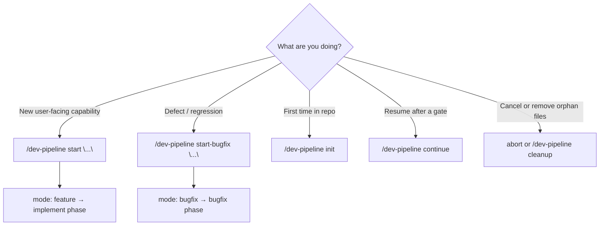
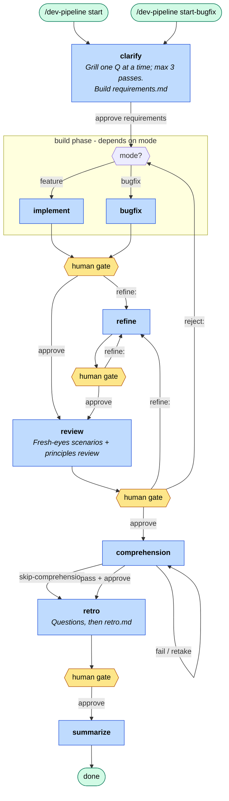

# Dev Pipeline

Multi-phase development workflow with human review gates. Orchestrated by the `dev-pipeline` skill.

## Installation

Clone this repo once, then wire it into each project you work on. Skills are designed for **Cursor** (they live under `.cursor/`). If you use a different agent harness, the workflow content still applies — adapt paths, skill discovery, and invocation to match your tool.

### Cursor (recommended): clone + symlink

```bash
cd /path/to/your-project
mkdir -p .cursor/workflows/learnings

# skills + fixtures (fixtures path is referenced from dev-pipeline skill docs)
ln -s ~/src/ai-workflow/skills .cursor/skills
ln -s ~/src/ai-workflow/fixtures .cursor/fixtures

# seed durable learnings file (summarize rewrites this after each pipeline)
cp ~/src/ai-workflow/workflows/learnings/gotchas.md .cursor/workflows/learnings/gotchas.md
```

Symlinking `skills/` and `fixtures/` keeps every project on the same bundle. Pull updates in the clone and all linked projects pick them up.

**Do not hand-write `PROJECT.md`.** Run `/dev-pipeline init` once per repo — it inspects the project and generates `.cursor/workflows/PROJECT.md`. Every phase reads it.

**`gotchas.md`** is per-project durable memory. Copy the starter above (or create an empty file with a `# Gotchas & Learnings` heading). Phases skim it during runs; **summarize** rewrites it at the end of each pipeline.

Ephemeral files (`artifacts/`, `state.json`, `STATUS.md`) are created automatically when you `/dev-pipeline start` — you don't set those up.

### Copy instead of symlink

If you prefer a frozen copy per project:

```bash
cp -r ~/src/ai-workflow/skills .cursor/skills
cp -r ~/src/ai-workflow/fixtures .cursor/fixtures
mkdir -p .cursor/workflows/learnings
cp ~/src/ai-workflow/workflows/learnings/gotchas.md .cursor/workflows/learnings/gotchas.md
```

Then run `/dev-pipeline init` to generate `PROJECT.md`.

### Other agent harnesses

These skills assume Cursor’s layout (`.cursor/skills/*/SKILL.md`, slash-command invocation, `disable-model-invocation` frontmatter). To use them elsewhere:

- Map `skills/` to however your harness loads agent instructions
- Map `.cursor/workflows/` to a durable + ephemeral artifact directory in your project
- Replace `/dev-pipeline …` triggers with your harness’s equivalent (prompt prefix, slash command, or skill name)

The state machine (`state.json`), routing table (`skills/dev-pipeline/state-schema.md`), and phase handoff markdown files are harness-agnostic — only discovery and invocation need adapting.

## Skills

| Skill | Invoke | Purpose |
|-------|--------|---------|
| `dev-pipeline` | `/dev-pipeline` | Start, init, status, continue, cleanup, and orchestrate the pipeline |
| `workflow-*` | (internal) | Phase work — launched by the orchestrator |

## First-time setup (per repo)

After installation, in the target project:

```
/dev-pipeline init
```

This writes `.cursor/workflows/PROJECT.md` from the repo contents. Do not create that file yourself — init keeps it accurate to the stack and layout.

Then start a pipeline:

```
/dev-pipeline start "<task>"
```

## Which command to use?



| Situation | Command |
|-----------|---------|
| New feature | `/dev-pipeline start "<task>"` |
| Bug fix | `/dev-pipeline start-bugfix "<task>"` |
| Explicit diff base | `/dev-pipeline start "<task>" --base develop` |
| Resume pipeline | `/dev-pipeline continue` (new agent; approve assumed on advance gates) |
| Cancel + delete ephemeral files | `abort` or `/dev-pipeline cleanup` |

Both **feature** and **bugfix** run the same phases after clarify; only the build step differs.

## Quick start

```
/dev-pipeline start "Add retry logic to notification emails"
```

```
/dev-pipeline start-bugfix "Fix duplicate notification emails on retry"
```

## Monitor progress

| What | Where |
|------|-------|
| Human-readable status | `.cursor/workflows/STATUS.md` (active pipeline only) |
| Machine state | `.cursor/workflows/state.json` (JSON Schema in skill bundle) |
| Routing rules | `.cursor/skills/dev-pipeline/state-schema.md` (single source of truth) |
| In chat | `/dev-pipeline status` or `/dev-pipeline continue` |

Open `STATUS.md` in your editor and refresh after each agent turn.

### Multi-agent flow with `/dev-pipeline continue` (recommended)

1. **Start** — `/dev-pipeline start "<task>"` in one agent
2. **Continue** — open a **new agent** and run `/dev-pipeline continue`

At each gate, send the command for that step — usually `approve` to advance, or `refine:` (and at review, `reject:`) to iterate. **Recommended:** open a new agent after each phase; fresh context per step usually works better than running the whole pipeline in one chat. On advance gates, bare `/dev-pipeline continue` assumes approve and runs the next phase. Gates that need your input (**clarify**, **comprehension interview**, **retro questions**) wait for answers — no auto-advance. To stay in the same agent, send the gate command directly.

## Phases



| Phase | Who | What happens |
|-------|-----|--------------|
| **clarify** | AI + you | **Grilling session:** one question at a time (with a recommended answer), covering requirements *and* high-level implementation shape. Challenges fuzzy terms against `PROJECT.md` and existing code, stress-tests with scenarios. Updates `requirements.md` after each answer (max **3 passes**). No application code. |
| **implement** | AI | (feature) Code + tests per requirements. Reads `gotchas.md`. |
| **bugfix** | AI | (bugfix) Reproduce → regression test → minimal fix. |
| **refine** | AI | Addresses review feedback. |
| **review** | AI | Fresh-eyes scenario tests plus principles/security/design review in one pass → `review-report.md`. |
| **comprehension** | AI + you | **One question at a time** (free text or multiple choice) until you demonstrate understanding of functionality, code, and maintenance. Question count adapts to the diff. Pass or `skip-comprehension`. |
| **retro** | AI + you | **Two turns:** reflective questions → your answers → `retro.md` → `approve`. |
| **summarize** | AI | Consolidate `gotchas.md`, optional `PROJECT.md` update, delete ephemeral files. |

## Commands (at human gates)

| You type | Effect |
|----------|--------|
| `approve requirements` | clarify → build phase |
| `approve` | Advance to next phase |
| `refine: <feedback>` | Go to refine |
| `re-clarify: <note>` | Back to clarify |
| `reject: <reason>` | Back to build from **review** |
| `ready` / `retake` | After failed comprehension interview — new attempt |
| `skip-comprehension` | Skip interview unpassed (recorded; alias: `take the shame`) |
| `abort` | Cancel and **delete ephemeral files** |
| `/dev-pipeline cleanup` | Delete orphaned artifacts/state/STATUS |
| `/dev-pipeline continue` | New agent: resume — approve assumed on advance gates |

Full routing: `.cursor/skills/dev-pipeline/state-schema.md`

### Clarify gate

1. Agent asks **one question** with a **recommended answer** — reply with your answer (or accept the recommendation).
2. Agent updates `requirements.md` and asks the next question until the design tree for this pass is exhausted.
3. When the agent presents a summary, reply **`approve requirements`** to advance — or answer more if it asks follow-ups.
4. Max **3 passes**; after that, open items become explicit **Assumptions** in `requirements.md`. Use `re-clarify:` to reset.

### Comprehension gate

1. Agent asks **one question** at a time (free text or multiple choice) about what changed, where it lives in code, and how to maintain it.
2. Reply with your answer; the agent grades it and asks the next question until satisfied or failed.
3. If you **pass** → `approve` → retro.
4. If you **fail** → review code → `ready` for retake **or** `skip-comprehension` to proceed (waives quality gate; recorded).

### Retro gate (two turns)

1. **Turn 1:** Agent asks 3–5 reflective questions → **stop**. Reply with your answers (same or new chat with `/dev-pipeline continue` + answers).
2. **Turn 2:** Agent writes `retro.md` → reply **`approve`** → summarize runs automatically.

## State and diffs

On start, the pipeline records `base_branch` in `state.json` (default: `origin/main`, else `main`, else current branch). All phases use:

```bash
git diff {base_branch}...HEAD
```

Override at start: `/dev-pipeline start "<task>" --base develop`

## Artifacts (ephemeral)

During a run, handoffs live in `.cursor/workflows/artifacts/`. **Deleted on summarize, abort, or cleanup:**

- `task.md`, `requirements.md`, `implement-handoff.md`, `review-report.md`, `comprehension-test.md`, `retro.md`

## Durable docs (persist)

| File | Purpose |
|------|---------|
| `PROJECT.md` | Project context — init-generated; updated only for major features |
| `learnings/gotchas.md` | Consolidated pitfalls (≤20 bullets; rewritten each run) |

## End-to-end walkthrough (example)

**Task:** `/dev-pipeline start "Add retry logic to notification emails"`

1. **clarify** — Agent grills one question at a time (scope, behavior, implementation shape, tests) with a recommended answer; you reply; repeat until summary → `approve requirements`
2. **implement** — Code + tests → `implement-handoff.md` → you `approve` or `/dev-pipeline continue`
3. **review** — Fresh-eyes scenarios + principles review → `review-report.md` → `approve`
4. **comprehension** — One question at a time until understanding is demonstrated → `approve`
5. **retro** — Agent asks "Did review catch what you cared about?" → you answer → `retro.md` → `approve`
6. **summarize** — Updates gotchas, deletes artifacts

**Snippet — requirements.md (after clarify):**

```markdown
## Clarifications

| # | Question | Answer | Recommended |
|---|----------|--------|-------------|
| 1 | Max retries before giving up? | 3 with exponential backoff | 3 — matches existing job runner cap |

## Acceptance criteria
- [ ] Failed sends retry with exponential backoff (max 3)
- [ ] Idempotent — no duplicate emails on retry

## Implementation approach (high level)
- Extend `NotificationJob` retry policy; reuse `backoff()` from job runner
```

**Snippet — review-report.md:**

```markdown
## Verdict
APPROVE WITH NOTES

## Scenario verification
### Scenarios tested
| # | Scenario | Method | Result | Notes |
| 1 | Retry on transient failure | test | pass | ... |

## Principles review
### Summary
Backoff config matches existing job runner patterns; auth boundary on retry endpoint looks correct.
```

## Troubleshooting

| Problem | Fix |
|---------|-----|
| Stuck `status: ai_running` | `/dev-pipeline continue` — recovers if artifact complete; else re-run phase skill |
| Accidental implicit approve | Use `/dev-pipeline continue refine:` instead; clarify/comprehension/retro never auto-approve |
| Partial summarize (files left behind) | `/dev-pipeline cleanup` |
| Active pipeline won't start | `abort` or cleanup first |
| Wrong diff base | Restart with `--base <branch>` |
| Comprehension feels too long | Agent adapts question count to diff size; answer clearly to move on |

## Repo layout

| Path | Purpose |
|------|---------|
| `skills/` | Skill definitions → symlink to `.cursor/skills/` |
| `fixtures/` | Example `state.json` shape → symlink to `.cursor/fixtures/` |
| `workflows/learnings/gotchas.md` | Starter template → copy into each project's `.cursor/workflows/learnings/` |
| `skills/dev-pipeline/state.schema.json` | JSON Schema for pipeline state |
