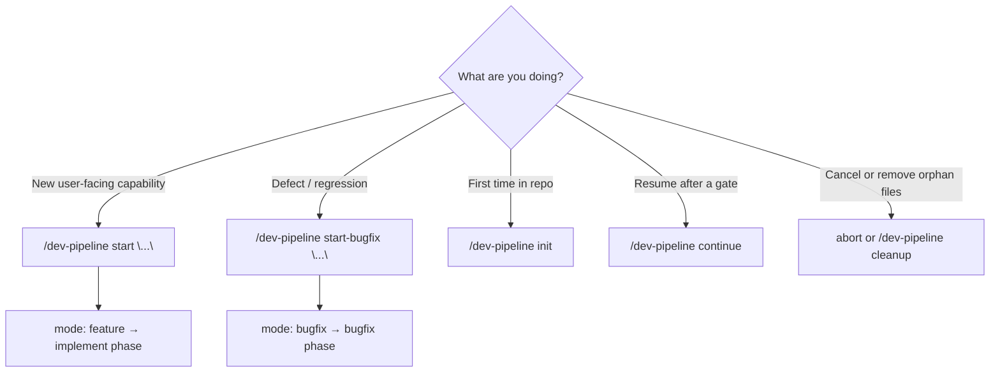
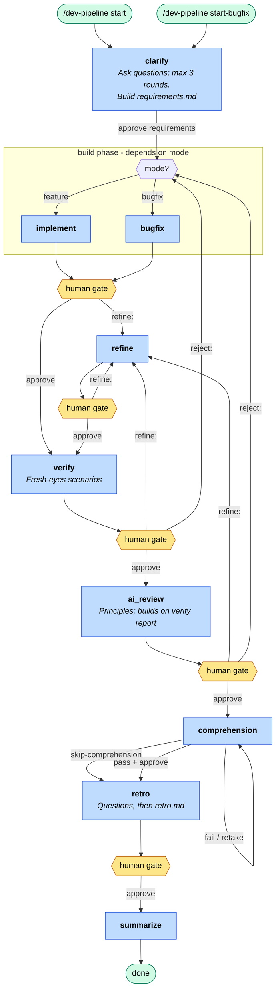

# Dev Pipeline

Multi-phase development workflow with human review gates. Orchestrated by the `dev-pipeline` skill.

## Installation

Clone this repo once, then wire it into each project you work on. Skills are designed for **Cursor** (they live under `.cursor/`). If you use a different agent harness, the workflow content still applies — adapt paths, skill discovery, and invocation to match your tool.

### Cursor (recommended): clone + symlink

```bash
cd /path/to/your-project
mkdir -p .cursor/workflows/learnings
ln -s ~/src/ai-workflow/skills .cursor/skills
```

Symlinking keeps every project on the same skill bundle. Pull updates in the clone and all linked projects pick them up.

`workflow-init` (`/dev-pipeline init`) writes `.cursor/workflows/PROJECT.md` in the target repo. Pipeline runs create ephemeral files under `.cursor/workflows/artifacts/` and `.cursor/workflows/state.json`; `learnings/gotchas.md` is updated at the end of each run.

### Copy instead of symlink

If you prefer a frozen copy per project:

```bash
cp -r ~/src/ai-workflow/skills .cursor/skills
mkdir -p .cursor/workflows/learnings
```

### Other agent harnesses

These skills assume Cursor’s layout (`.cursor/skills/*/SKILL.md`, slash-command invocation, `disable-model-invocation` frontmatter). To use them elsewhere:

- Map `skills/` to however your harness loads agent instructions
- Map `.cursor/workflows/` to a durable + ephemeral artifact directory in your project
- Replace `/dev-pipeline …` triggers with your harness’s equivalent (prompt prefix, slash command, or skill name)

The state machine (`state.json`), routing table (`skills/dev-pipeline/state-schema.md`), and phase handoff markdown files are harness-agnostic — only discovery and invocation need adapting.

## Skills

| Skill | Invoke | Purpose |
|-------|--------|---------|
| `dev-pipeline` | `/dev-pipeline` | Start, init, status, continue, cleanup, and orchestrate the pipeline |
| `workflow-*` | (internal) | Phase work — launched by the orchestrator |

## First-time setup (per repo)

When dropping these skills into a new repo, generate a project-specific `PROJECT.md` first:

```
/dev-pipeline init
```

This inspects the repo and writes `.cursor/workflows/PROJECT.md`. Every pipeline phase reads it.

## Which command to use?



| Situation | Command |
|-----------|---------|
| New feature | `/dev-pipeline start "<task>"` |
| Bug fix | `/dev-pipeline start-bugfix "<task>"` |
| Explicit diff base | `/dev-pipeline start "<task>" --base develop` |
| Resume pipeline | `/dev-pipeline continue` (new agent; approve assumed on advance gates) |
| Cancel + delete ephemeral files | `abort` or `/dev-pipeline cleanup` |

Both **feature** and **bugfix** run the same phases after clarify; only the build step differs.

## Quick start

```
/dev-pipeline start "Add retry logic to notification emails"
```

```
/dev-pipeline start-bugfix "Fix duplicate notification emails on retry"
```

## Monitor progress

| What | Where |
|------|-------|
| Human-readable status | `.cursor/workflows/STATUS.md` (active pipeline only) |
| Machine state | `.cursor/workflows/state.json` (JSON Schema in skill bundle) |
| Routing rules | `.cursor/skills/dev-pipeline/state-schema.md` (single source of truth) |
| In chat | `/dev-pipeline status` or `/dev-pipeline continue` |

Open `STATUS.md` in your editor and refresh after each agent turn.

### Multi-agent flow with `/dev-pipeline continue` (recommended)

1. **Start** — `/dev-pipeline start "<task>"` in one agent
2. **Continue** — open a **new agent** and run `/dev-pipeline continue`

At each gate, send the command for that step — usually `approve` to advance, or `refine:` (and at verify/ai_review, `reject:`) to iterate. **Recommended:** open a new agent after each phase; fresh context per step usually works better than running the whole pipeline in one chat. On advance gates, bare `/dev-pipeline continue` assumes approve and runs the next phase. Gates that need your input (**clarify**, **comprehension quiz**, **retro questions**) wait for answers — no auto-advance. To stay in the same agent, send the gate command directly.

## Phases



| Phase | Who | What happens |
|-------|-----|--------------|
| **clarify** | AI | Numbered questions (max **3 rounds**); builds `requirements.md`. No code. |
| **implement** | AI | (feature) Code + tests per requirements. Reads `gotchas.md`. |
| **bugfix** | AI | (bugfix) Reproduce → regression test → minimal fix. |
| **refine** | AI | Addresses review feedback. |
| **verify** | AI | Fresh-eyes scenario tests; populates **For AI review** section. |
| **ai_review** | AI | Principles/security/design — **does not re-run verify scenarios**. |
| **comprehension** | AI + you | Quiz (**light** 4–5 Q for small diffs, **standard** 8–10 otherwise). Pass >60% or `skip-comprehension`. |
| **retro** | AI + you | **Two turns:** reflective questions → your answers → `retro.md` → `approve`. |
| **summarize** | AI | Consolidate `gotchas.md`, optional `PROJECT.md` update, delete ephemeral files. |

## Commands (at human gates)

| You type | Effect |
|----------|--------|
| `approve requirements` | clarify → build phase |
| `approve` | Advance to next phase |
| `refine: <feedback>` | Go to refine |
| `re-clarify: <note>` | Back to clarify |
| `reject: <reason>` | Back to build from **verify** or **ai_review** |
| `ready` / `retake` | After failed comprehension — new test |
| `skip-comprehension` | Skip quiz unpassed (recorded; alias: `take the shame`) |
| `abort` | Cancel and **delete ephemeral files** |
| `/dev-pipeline cleanup` | Delete orphaned artifacts/state/STATUS |
| `/dev-pipeline continue` | New agent: resume — approve assumed on advance gates |

Full routing: `.cursor/skills/dev-pipeline/state-schema.md`

### Comprehension gate

1. Answer numbered questions in chat.
2. If you **pass** → `approve` → retro.
3. If you **fail** → review code → `ready` for retake **or** `skip-comprehension` to proceed (waives quality gate; score recorded).

### Retro gate (two turns)

1. **Turn 1:** Agent asks 3–5 reflective questions → **stop**. Reply with your answers (same or new chat with `/dev-pipeline continue` + answers).
2. **Turn 2:** Agent writes `retro.md` → reply **`approve`** → summarize runs automatically.

## State and diffs

On start, the pipeline records `base_branch` in `state.json` (default: `origin/main`, else `main`, else current branch). All phases use:

```bash
git diff {base_branch}...HEAD
```

Override at start: `/dev-pipeline start "<task>" --base develop`

## Artifacts (ephemeral)

During a run, handoffs live in `.cursor/workflows/artifacts/`. **Deleted on summarize, abort, or cleanup:**

- `task.md`, `requirements.md`, `implement-handoff.md`, `verify-report.md`, `ai-review.md`, `comprehension-test.md`, `retro.md`

## Durable docs (persist)

| File | Purpose |
|------|---------|
| `PROJECT.md` | Project context — init-generated; updated only for major features |
| `learnings/gotchas.md` | Consolidated pitfalls (≤20 bullets; rewritten each run) |

## End-to-end walkthrough (example)

**Task:** `/dev-pipeline start "Add retry logic to notification emails"`

1. **clarify** — Agent asks scope/acceptance questions → you answer → `approve requirements`
2. **implement** — Code + tests → `implement-handoff.md` → you `approve` or `/dev-pipeline continue`
3. **verify** — Fresh-eyes scenarios → `verify-report.md` with verdict + "For AI review" → `approve`
4. **ai_review** — Reviews verify deltas + security/design → `ai-review.md` → `approve`
5. **comprehension** — 8 questions (or 4 if small diff) → you pass → `approve`
6. **retro** — Agent asks "Did verify catch what you cared about?" → you answer → `retro.md` → `approve`
7. **summarize** — Updates gotchas, deletes artifacts

**Snippet — requirements.md (after clarify):**

```markdown
## Acceptance criteria
- [ ] Failed sends retry with exponential backoff (max 3)
- [ ] Idempotent — no duplicate emails on retry
```

**Snippet — verify-report.md:**

```markdown
## Verdict
PASS WITH NOTES
## For AI review (do not re-test these unless needed)
- Confirm backoff config matches existing job runner patterns
```

## Troubleshooting

| Problem | Fix |
|---------|-----|
| Stuck `status: ai_running` | `/dev-pipeline continue` — recovers if artifact complete; else re-run phase skill |
| Accidental implicit approve | Use `/dev-pipeline continue refine:` instead; clarify/comprehension/retro never auto-approve |
| Partial summarize (files left behind) | `/dev-pipeline cleanup` |
| Active pipeline won't start | `abort` or cleanup first |
| Wrong diff base | Restart with `--base <branch>` |
| Comprehension too long for tiny change | Automatic **light** mode (≤3 files, ≤150 lines) |

## Repo layout

| Path | Purpose |
|------|---------|
| `skills/` | Skill definitions (symlink into `.cursor/skills/`) |
| `fixtures/` | Example `state.json` and golden routing transitions |
| `skills/dev-pipeline/state.schema.json` | JSON Schema for pipeline state |
